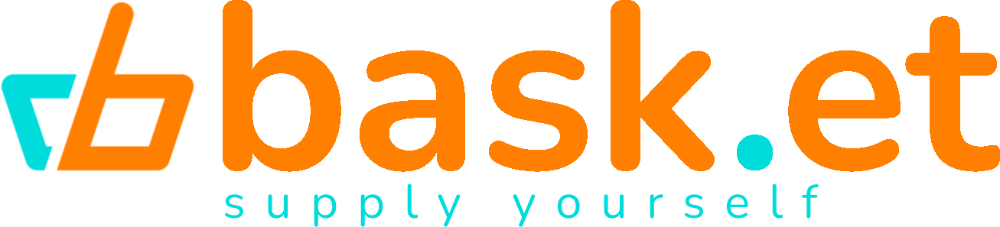

# BHL Hackathon 2022 - Some random bois

# Bask.et

#### Bask.et to Twój personalny doradca przygotowywujący najoptymalniejsze miejsca wykonania zakupów. Wprówadź swoją listę zakupów lub plik z przepisem i otrzymaj listę najbliższych sklepów z dostępnymi produktamii ich cenami!  
### Uruchomienie projektu

W celu uruchomienia projektu wystarczy przy użyciu narzędzia docker compose w katalogu głównym projektu. 
Należy w tym celu wywołać komendę `docker-compose up --build -d`. 
Po pobraniu wszystkich zależności aplikacja jest gotowa do użytku. 
Ponadto korzystając z skryptów SQL dostępnych w repozytorium, można dodać do bazy danych dane z różnych źródeł . 
Po odpowiednim przygotowaniu aplikację możmy uruchomić przy pomocy przeglądarki wchodząc na adres: `http://localhost:3030`.
